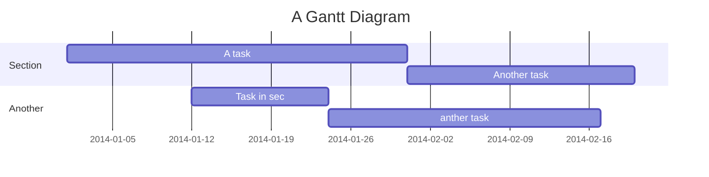
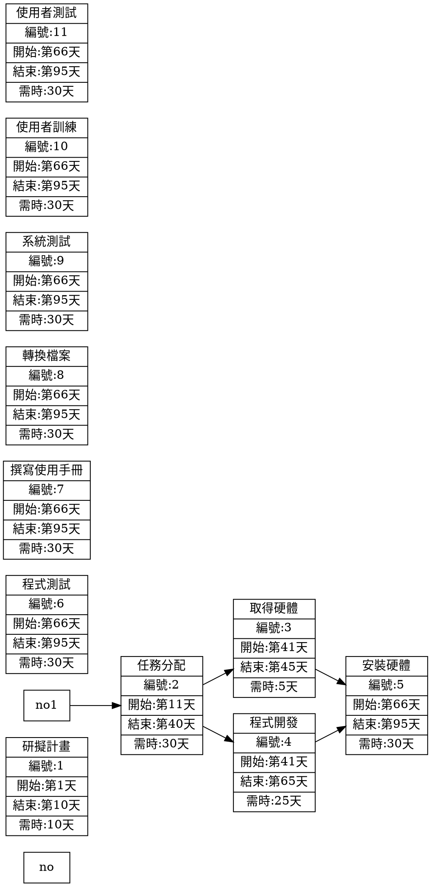

# 專案管理
## 甘特圖

```mermaid
gantt
    title A Gantt Diagram
    section Section
    A task           :a1, 2014-01-01, 30d
    Another task     :after a1  , 20d
    section Another
    Task in sec      :2014-01-12  , 12d
    anther task      : 24d
```

---
## PERT/CPM圖
## 關鍵路徑
研擬計畫
任務分配
取得硬體
程式開發
安裝硬體
程式測試
撰寫使用手冊
轉換檔案
系統測試
使用者訓練

```graphviz
digraph {
	node[shape=record];
	rankdir="LR";
    no 1 [label = "研擬計畫    | 編號:1  | 開始:第1天  | 結束:第10天 | 需時:10天"]
    no2  [label = "任務分配    | 編號:2  | 開始:第11天 | 結束:第40天 | 需時:30天"]
    no3  [label = "取得硬體    | 編號:3  | 開始:第41天 | 結束:第45天 | 需時:5天"]
    no4  [label = "程式開發    | 編號:4  | 開始:第41天 | 結束:第65天 | 需時:25天"]
    no5  [label = "安裝硬體    | 編號:5  | 開始:第66天 | 結束:第95天 | 需時:30天"]
    no6  [label = "程式測試    | 編號:6  | 開始:第66天 | 結束:第95天 | 需時:30天"]
    no7  [label = "撰寫使用手冊| 編號:7  | 開始:第66天 | 結束:第95天 | 需時:30天"]
    no8  [label = "轉換檔案    | 編號:8  | 開始:第66天 | 結束:第95天 | 需時:30天"]
    no9  [label = "系統測試    | 編號:9  | 開始:第66天 | 結束:第95天 | 需時:30天"]
    no10 [label = "使用者訓練  | 編號:10 | 開始:第66天 | 結束:第95天 | 需時:30天"]
    no11 [label = "使用者測試  | 編號:11 | 開始:第66天 | 結束:第95天 | 需時:30天"]
    no1->no2
    {rank=same;no3 no4}
    no2->no3
    no2->no4
    
    no3->no5
    no4->no5
}
```

